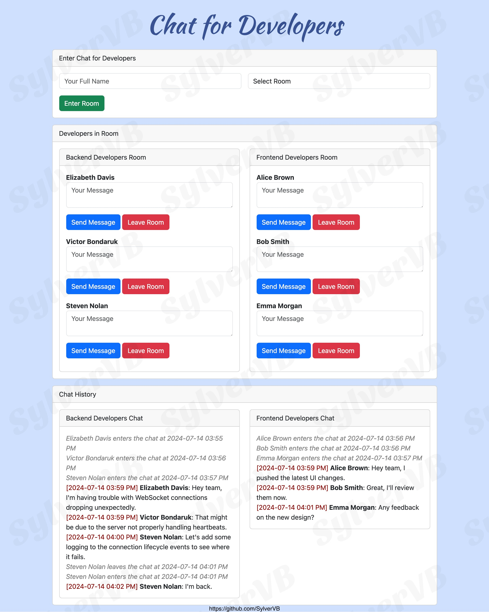

# Chat for Developers

Welcome to the "Chat for Developers" application! This project is designed to facilitate real-time communication between developers. It allows users to join chat rooms, send messages, and manage user interactions effectively. The application is built using Flask, Flask-SocketIO, and Bootstrap for the frontend.



## Table of Contents
- [Chat for Developers](#chat-for-developers)
  - [Table of Contents](#table-of-contents)
  - [Features](#features)
  - [Project Structure](#project-structure)
  - [Backend Implementation](#backend-implementation)
    - [WebSocket Setup and Configuration](#websocket-setup-and-configuration)
    - [WebSocket Events and Handlers](#websocket-events-and-handlers)
    - [Chat Room Management](#chat-room-management)
    - [Flask Application](#flask-application)
  - [Installation](#installation)
    - [Prerequisites](#prerequisites)
    - [Steps](#steps)
  - [Usage](#usage)
    - [Socket Events](#socket-events)
  - [Requirements](#requirements)
    - [Python Packages](#python-packages)
    - [Frontend Libraries](#frontend-libraries)
  - [Contributing](#contributing)
  - [License](#license)
  - [Contributors License Agreement (CLA)](#contributors-license-agreement-cla)

## Features
- Real-time messaging using WebSocket connections.
- User-friendly interface with Bootstrap.
- Users can join specific chat rooms (Backend Developers Room or Frontend Developers Room).
- Automatic capitalization of user names.
- System messages for user entry and exit from chat rooms.
- Chat history display for both rooms.

## Project Structure
```
.
├── static
│   └── main.js                 # Frontend JavaScript file handling socket events
│   └── style.css               # CSS file for styling
├── templates
│   └── index.html              # Main HTML file for the chat application
├── assets
│   └── chat_screenshot.png     # Chat screenshot
├── .gitignore                  # Git ignore file
├── app.py                      # Main backend Flask application file
├── /venv                       # Virtual environment
├── .env                        # Environment variables
├── requirements.txt            # Python dependencies
└── README.md                   # This README file
```

## Backend Implementation
The backend of this application is implemented using Flask and Flask-SocketIO. Below are the key components and functionalities:

### WebSocket Setup and Configuration
- **WebSocket Server**: Configured using Flask-SocketIO to handle real-time, bi-directional communication.
- **CORS Configuration**: Ensures that the WebSocket server can communicate with the frontend.

### WebSocket Events and Handlers
- **Connection Events**: Manage user connections, including joining and leaving chat rooms.
- **Message Events**: Handle the sending and receiving of messages, with real-time broadcasting to all users in a room.

### Chat Room Management
- **Join and Leave**: Users can join specific chat rooms, and the backend will broadcast messages to notify other users in the room.
- **Real-Time Messaging**: Supports real-time messaging with timestamps and user information.

### Flask Application
The Flask application (`app.py`) handles the main routing and integrates with Flask-SocketIO to manage WebSocket connections.

## Installation

### Prerequisites
- Python 3.7+
- Node.js (for managing frontend dependencies, if needed)

### Steps
1. **Clone the repository:**
   ```bash
   git clone https://github.com/SylverVB/SPN-BE-HW-W3D3-Chat-Application-Project.git
   cd SPN-BE-HW-W3D3-Chat-Application-Project
   ```

2. **Create a virtual environment and activate it:**
   ```bash
   python -m venv venv
   source venv/bin/activate  # On Windows use `venv\Scripts\activate`
   ```

3. **Install the required dependencies:**
   ```bash
   pip install -r requirements.txt
   ```

4. **Set up environment variables:**
   Create a `.env` file in the root directory and add your secret key:
   ```bash
   SECRET_KEY=your-secret-key
   ```

5. **Run the Flask application:**
   ```bash
   python app.py
   ```

6. **Open your browser and navigate to:**
   ```
   http://localhost:5000
   ```

## Usage

1. **Enter your full name and select a room to join.**
2. **Start chatting with other developers in the room.**
3. **To leave the room, click the 'Leave Room' button.**

### Socket Events
- **join**: Sent when a user joins a room.
- **leave**: Sent when a user leaves a room.
- **message**: Sent when a user sends a message.
- **system_message**: Broadcasted when a user joins or leaves a room.
- **chat_message**: Broadcasted when a user sends a message.

## Requirements

### Python Packages
- Flask==3.0.3
- Flask-Cors==4.0.1
- Flask-SocketIO==5.3.6
- python-dotenv==1.0.1

### Frontend Libraries
- Bootstrap 5.3.3
- Socket.IO 4.7.5

## Contributing
Contributions are welcome! Please open an issue or submit a pull request.

## License
This application is the property of Victor Bondaruk. As the owner, [Victor Bondaruk](https://github.com/SylverVB) retains all rights to the application.

## Contributors License Agreement (CLA)
By making a contribution to this project, you agree to the following terms and conditions for your contributions:

1. You grant the owner, Victor Bondaruk, a perpetual, worldwide, non-exclusive, no-charge, royalty-free, irrevocable license to use, distribute, and modify your contributions as part of this project.
2. You represent that you are legally entitled to grant the above license.
3. You agree to promptly notify the owner of any facts or circumstances of which you become aware that would make these representations inaccurate in any respect.